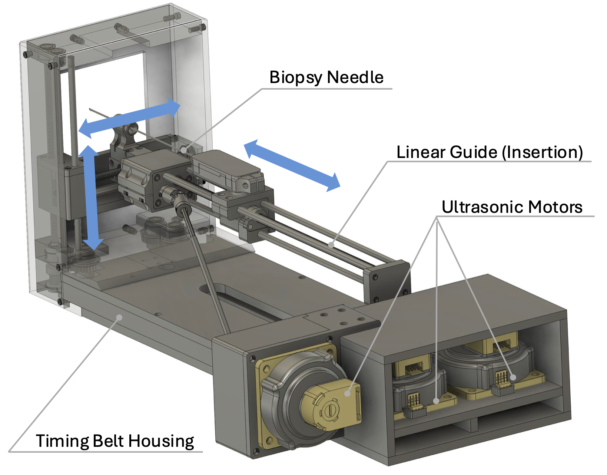

# Open-Source MRI-Conditional Needle Guiding Manipulator Project
## Overview
Needle placement is essential in cancer care for procedures such as biopsies and thermal ablations. As modern diagnostic technologies enable the detection of smaller tumors, the demand for precise needle placement has increased significantly. Prior studies have explored robotic assistance to enhance the safety and accuracy of needle placement in response to this clinical need. However, clinical translation remains challenging, partly due to the lack of accessible research platforms. This project aims to develop an open-source robotics research platform for MRI-guided needle placement, which can be assembled from 3D-printed parts and readily available components.

## List of Packages

## Contributors
- Junichi Tokuda, Ph.D. (Brigham and Women’s Hospital and Harvard Medical School) -- PI, CAD
- Mariana Bernardes, Ph.D. (Brigham and Women’s Hospital and Harvard Medical School) -- ROS module for Smart Template
- Simon Leonard, Ph.D., Johns Hopkins University -- ROS Controller
- Anton Deguet, Johns Hopkins University -- Slicer/ROS Integration
- Pedro Moreira, Ph.D., (Brigham and Women’s Hospital and Harvard Medical School) -- Electronics
- Laura Connolly, M.S., (Johns Hopkins University / Queen's University) -- Slicer/ROS Integration

## References
1. Song SE, Tokuda J, Tuncali K, Tempany CM, Zhang E, Hata N. Development and preliminary evaluation of a motorized needle guide template for MRI-guided targeted prostate biopsy. IEEE Trans Biomed Eng. 2013 Nov;60(11):3019-27. doi: 10.1109/TBME.2013.2240301. Epub 2013 Jan 15. PMID: 23335658; PMCID: PMC3778164.
1. Tilak G, Tuncali K, Song SE, Tokuda J, Olubiyi O, Fennessy F, Fedorov A, Penzkofer T, Tempany C, Hata N. 3T MR-guided in-bore transperineal prostate biopsy: A comparison of robotic and manual needle-guidance templates. J Magn Reson Imaging. 2015 Jul;42(1):63-71. doi: 10.1002/jmri.24770. Epub 2014 Sep 27. PMID: 25263213; PMCID: PMC4376663.
1. Bernardes MC, Moreira P, Lezcano D, Foley L, Tuncali K, Tempany C, Kim JS, Hata N, Iordachita I, Tokuda J. In Vivo Feasibility Study: Evaluating Autonomous Data-Driven Robotic Needle Trajectory Correction in MRI-Guided Transperineal Procedures. IEEE Robot Autom Lett. 2024 Oct;9(10):8975-8982. doi: 10.1109/lra.2024.3455940. Epub 2024 Sep 6. PMID: 39371576; PMCID: PMC11448709.
1. Connolly L, Deguet A, Leonard S, Tokuda J, Ungi T, Krieger A, Kazanzides P, Mousavi P, Fichtinger G, Taylor RH. Bridging 3D Slicer and ROS2 for Image-Guided Robotic Interventions. Sensors (Basel). 2022 Jul 17;22(14):5336. doi: 10.3390/s22145336. PMID: 35891016; PMCID: PMC9324680.

## Acknowledgement
The project is supported by the U.S. National Institutes of Health (NIH) under award number R01EB020667, R01CA235134, and P41EB028741. The content is solely the responsibility of the authors and does not necessarily represent the official views of the NIH.
